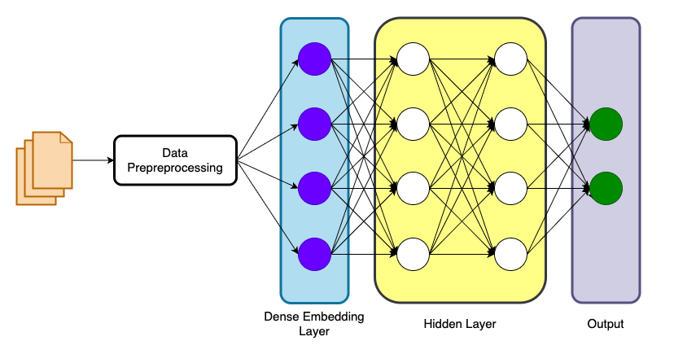
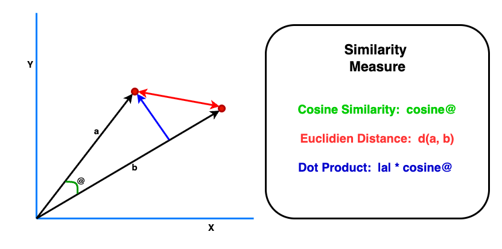

# RAG Fundamentals: Understanding the Building Blocks

Before diving into building Retrieval-Augmented Generation (RAG) systems, we need to understand the fundamental concepts that make RAG possible. This guide will walk you through the essential building blocks: tokens, tokenization, embeddings, vector search, and vector databases.

## Table of Contents

1. [What is a Token?](#what-is-a-token)
2. [Understanding Tokenization](#understanding-tokenization)
3. [What are Embeddings?](#what-are-embeddings)
4. [How Are Embeddings Trained?](#how-are-embeddings-trained)
5. [How Does Vector Search Work?](#how-does-vector-search-work)
6. [What is a Vector Database?](#what-is-a-vector-database)
7. [Putting It All Together](#putting-it-all-together-rag-pipeline)

## What is a Token?

A **token** is the smallest unit of text that a language model can process. Think of tokens as the "words" that AI models understand.

### How Tokenization Works

When you input text into an AI model, it doesn't process full words or sentences directly. Instead, it breaks the text into tokens.

**Rule of thumb**: 1 token ≈ 0.75 words (or ~4 characters in English)

**Example**:
```
Text: "Hello, how are you?"
Tokens: ["Hello", ",", " how", " are", " you", "?"]
Token count: 6 tokens
```

### Why Tokens Matter

- **Context windows**: Models have token limits (e.g., 128K tokens for Claude)
- **Cost**: API pricing is based on tokens
- **Performance**: Token count affects processing speed
- **Understanding**: Affects how models interpret text

## Understanding Tokenization

**Tokenization** is the process of breaking text into tokens. It's the critical first step before any AI processing happens.

### Types of Tokenization

#### 1. **Word-Based Tokenization**
Splits text by spaces and punctuation

```
Input: "unhappiness is bad"
Tokens: ["unhappiness", "is", "bad"]
```

**Limitations**:
- Large vocabulary size (every word needs entry)
- Can't handle unknown words
- No understanding of word relationships

#### 2. **Character-Based Tokenization**
Each character is a token

```
Input: "ChatGPT"  
Tokens: ["C", "h", "a", "t", "G", "P", "T"]
```

**Limitations**:
- Very long sequences
- Loses word-level meaning
- Computationally expensive

#### 3. **Subword Tokenization** (Modern Standard) ⭐
Breaks words into meaningful subunits

```
Input: "unhappiness is bad"
Tokens: ["un", "happiness", "is", "bad"]
```

**Advantages**:
- Balanced vocabulary size
- Handles rare/unknown words
- Captures morphology (prefixes, suffixes)
- Most efficient for modern LLMs

**Common Algorithms**:
- **BPE (Byte Pair Encoding)**: Used by GPT models
- **WordPiece**: Used by BERT
- **SentencePiece**: Language-agnostic, used by many models

## From Tokens to Token IDs

Because LLM models can only process numerical inputs, not text strings, after text is split into tokens, each token is converted to a **token ID** - a unique integer that represents that token in the model's vocabulary.

### The Process

```
Text: "Hello world"
↓ Tokenization
Tokens: ["Hello", " world"]
↓ ID Mapping
Token IDs: [15496, 1917]
↓ Model Processing
Embeddings: [[0.23, 0.45, ...], [0.67, 0.12, ...]]
```

### Vocabulary

Every model has a **vocabulary** - a fixed set of tokens it knows:
- GPT-4: ~100,000 tokens
- Claude: ~100,000 tokens
- Llama: ~32,000 tokens

**Out-of-vocabulary handling**: Subword tokenization breaks unknown words into known subwords

### Different Models, Different Tokenizers

**Important**: The same text can have different token counts across different models.

```
Text: "Artificial Intelligence is transforming industries"

GPT-4 tokenizer: 7 tokens
Claude tokenizer: 8 tokens  
Llama tokenizer: 9 tokens
```

**Why this matters for RAG**:
- Different models chunk documents differently
- Token limits vary by model
- Cost calculations differ per model

## What are Embeddings?

Token IDs represent text as numbers, but they fail to capture the **meaning** of words and **relationships** between words. This is where **embeddings** play a crucial role.

**Embeddings** are numerical representations of text that capture semantic meaning. They convert words, sentences, or documents into vectors (arrays of numbers) that machines can understand and compare.


### The Core Idea

**Similar meanings → Similar vectors**

```
"king" → [0.8, 0.9, 0.1, 0.2, ...]
"queen" → [0.7, 0.85, 0.15, 0.18, ...]
"car" → [0.1, 0.2, 0.8, 0.75, ...]
```

In this simplified example, "king" and "queen" have similar vectors because they have related meanings, while "car" is very different.

### Mathematical Relationships

Embeddings capture semantic relationships:

```
embedding("king") - embedding("man") + embedding("woman") ≈ embedding("queen")
```

This shows embeddings understand that:
- King is to man as queen is to woman
- The "royalty" concept is preserved
- The "gender" concept is transformed

### Dimensions

Embeddings are high-dimensional vectors:
- **Small models**: 384 dimensions
- **Medium models**: 768 dimensions
- **Large models**: 1536-3072 dimensions

**More dimensions** = More nuanced meaning capture (but slower and more storage)

### Types of Embeddings for RAG

#### 1. **Word Embeddings**
One vector per word

**Example models**: Word2Vec, GloVe

**Use case**: Basic semantic search

```
"cat" → [0.2, 0.8, 0.3, ...]
```

#### 2. **Sentence Embeddings**
One vector per sentence

**Example models**: Sentence-BERT, all-MiniLM

**Use case**: Short text similarity

```
"The cat sat on the mat" → [0.1, 0.4, 0.7, ...]
```

#### 3. **Document Embeddings**
One vector per document/paragraph

**Example models**: doc2vec, Instructor

**Use case**: Long-form content retrieval (RAG)

```
[entire paragraph] → [0.3, 0.6, 0.2, ...]
```

#### 4. **Token Embeddings**
One vector per token (internal model use)

**Use case**: Input layer of transformer models

## How Are Embeddings Trained?

Embeddings are created using neural networks trained on massive amounts of text data. Here's how the training process works.

### The Training Process



#### Step 1: **Collect Massive Text Data**
- Wikipedia (millions of articles)
- Books (billions of words)
- Websites (Common Crawl dataset)
- Scientific papers
- Code repositories

**Scale**: Often 100GB+ of text data

#### Step 2: **Define Training Objective**

Different objectives create different embedding properties:

**Masked Language Modeling** (BERT-style):
```
Input: "The [MASK] sat on the mat"
Task: Predict "cat"
```

**Contrastive Learning** (Modern approach):
```
Task: Make similar sentences have similar embeddings
      Make different sentences have different embeddings
```

**Next Sentence Prediction**:
```
Given: "The cat is sleeping."
Task: Is "It's very tired" or "The moon is bright" next?
```

#### Step 3: **Train Neural Network**
- **Architecture**: Transformer-based (BERT, GPT, etc.)
- **Parameters**: Millions to billions
- **Training time**: Weeks to months on powerful GPUs
- **Cost**: Can cost hundreds of thousands to millions of dollars

#### Step 4: **Learn Patterns**
The model learns:
- Which words appear together
- Syntactic patterns
- Semantic relationships
- Contextual meanings

#### Step 5: **Create Vector Space**
Where similar meanings cluster together in high-dimensional space

### Why Pre-trained Embeddings Work

**Transfer learning**: Models trained on general text work for specific domains because they've learned fundamental language patterns.

**Fine-tuning**: Can adapt pre-trained embeddings to specific domains for better performance.

## How Does Vector Search Work?

Vector search (also called semantic search or similarity search) finds similar items by comparing their embeddings in vector space.

### The Basic Process

#### **Step 1: Convert Query to Embedding**
```
User query: "How does machine learning work?"
↓ Embedding Model
Query embedding: [0.23, 0.67, 0.12, ..., 0.89]
```

#### **Step 2: Compare with Stored Embeddings**
Calculate similarity between query embedding and all document embeddings in the database.

```
Query: [0.23, 0.67, 0.12, ...]

Doc 1: [0.25, 0.65, 0.10, ...] → Similarity: 0.95
Doc 2: [0.10, 0.20, 0.80, ...] → Similarity: 0.42
Doc 3: [0.22, 0.68, 0.15, ...] → Similarity: 0.98
...
```

#### **Step 3: Rank by Similarity**
Sort documents by similarity score (highest to lowest)

```
Ranking:
1. Doc 3 (0.98)
2. Doc 1 (0.95)
3. Doc 7 (0.87)
4. Doc 4 (0.79)
5. Doc 2 (0.42)
...
```

#### **Step 4: Return Top Results**
Return the k most similar documents (e.g., top 5)

### Measuring Similarity



There are several mathematical ways to measure how similar two vectors are:

#### 1. **Cosine Similarity** (Most Common in RAG) ⭐

Measures the **angle** between two vectors, ignoring magnitude.

**Range**: -1 to 1
- **1** = identical direction (most similar)
- **0** = perpendicular (unrelated)
- **-1** = opposite directions (most dissimilar)

**Formula**: 
```
cosine_similarity = (A · B) / (||A|| × ||B||)
```

**Why it's used**:
- Direction matters more than magnitude for semantic meaning
- Normalized (always between -1 and 1)
- Fast to compute
- Works well for high-dimensional spaces
- Robust to document length differences

**Example interpretation**:
- **0.9-1.0**: Very similar (near-duplicates)
- **0.7-0.9**: Similar (related topics)
- **0.5-0.7**: Somewhat related
- **Below 0.5**: Not very related

**Visual Example**:
```
Vector A: [3, 4]
Vector B: [6, 8]
These point in the same direction → High cosine similarity (1.0)

Vector A: [3, 4]
Vector C: [4, -3]
These are perpendicular → Cosine similarity (0.0)
```

#### 2. **Euclidean Distance** (L2 Distance)

Straight-line distance between two points in space.

**Range**: 0 to ∞
- **0** = identical
- **Larger** = more different

**Formula**: 
```
distance = √(Σ(A_i - B_i)²)
```

**When to use**:
- When magnitude matters
- For image embeddings
- When embeddings are already normalized
- Spatial clustering

**Limitation**: Affected by vector magnitude (longer documents score differently)

#### 3. **Dot Product**

Simple multiplication of corresponding elements.

**Range**: -∞ to ∞ (higher = more similar)

**Formula**: 
```
dot_product = Σ(A_i × B_i)
```

**When to use**:
- When embeddings are normalized (equivalent to cosine similarity)
- Fastest to compute
- Good for approximate search
- Many vector databases optimize for this

**Note**: If vectors are normalized (length = 1), dot product = cosine similarity

### Vector Search in Action

**Scenario**: You have 1,000 documents embedded in your vector database.

**Query**: "What is artificial intelligence?"

**Process**:
1. Query embedded: [0.23, 0.67, 0.12, ..., 0.89]
2. Compare with 1,000 document embeddings
3. Calculate 1,000 similarity scores
4. Sort by score
5. Return top 10 documents

**Results**:
```
1. "Introduction to AI" (similarity: 0.94)
2. "Machine Learning Basics" (similarity: 0.89)
3. "Neural Networks Explained" (similarity: 0.85)
...
```

## What is a Vector Database?

A **vector database** is a specialized database designed to store, index, and efficiently search high-dimensional vectors (embeddings).

### Why Do We Need Vector Databases?

**The Problem**: Traditional databases can't efficiently handle vector similarity search.

**Naive approach** for 1 million documents:

```python
# This is O(n) complexity - must check EVERY vector!
for document in database:
    similarity = calculate_similarity(query_vector, document_vector)
results = sort_by_similarity(similarities)
return top_k(results)
```

**Performance issue**:
- 1 million vectors × 768 dimensions = ~750 million calculations
- Takes several seconds
- Unacceptably slow for real-time applications

**The Solution**: Vector databases use specialized data structures and algorithms to make search **sub-linear** (O(log n) or even O(1)).

### How Vector Databases Achieve Speed

#### 1. **Indexing Algorithms**

**HNSW (Hierarchical Navigable Small World)** ⭐ Most Popular
- Graph-based structure
- Multi-layer navigation
- Fast approximate search
- High recall rates

**IVF (Inverted File Index)**
- Clusters similar vectors
- Searches only relevant clusters
- Good for large datasets

**Product Quantization**
- Compresses vectors
- Reduces memory usage
- Slightly lower accuracy

#### 2. **Approximate Nearest Neighbor (ANN)**

**Trade-off**: Speed vs Accuracy
- Finds "close enough" matches
- 95-99% accuracy with 100x speedup
- Good enough for most RAG applications

**Exact search** (brute force):
- 100% accuracy
- Too slow for large databases

#### 3. **Filtering and Metadata**

Combine vector search with traditional filters:
```sql
Find similar documents
WHERE category = "science"
AND date > "2024-01-01"
```

### Popular Vector Databases

| Database | Type | Best For |
|----------|------|----------|
| **Pinecone** | Managed | Production RAG, easy setup |
| **Weaviate** | Open source | Flexible schemas, modules |
| **Qdrant** | Open source | High performance, Rust-based |
| **Milvus** | Open source | Large scale, distributed |
| **Chroma** | Open source | Development, testing |
| **FAISS** | Library | Research, prototyping |
| **pgvector** | PostgreSQL extension | Existing Postgres users |

### Vector Database Structure

**Collection/Index**: Container for related vectors

```
Collection: "company_documents"
+----+---------------------------+----------------------------------+
| id | embedding                 | metadata                         |
+----+---------------------------+----------------------------------+
| 1  | [0.1, 0.2, ..., 0.8]     | {title: "Intro to ML",           |
|    |                           |  author: "John",                 |
|    |                           |  category: "AI",                 |
|    |                           |  date: "2024-01-15"}             |
+----+---------------------------+----------------------------------+
| 2  | [0.3, 0.1, ..., 0.6]     | {title: "Python Guide",          |
|    |                           |  author: "Sarah",                |
|    |                           |  category: "Programming",        |
|    |                           |  date: "2024-02-20"}             |
+----+---------------------------+----------------------------------+
```

**Components**:
- **ID**: Unique identifier
- **Embedding**: High-dimensional vector (e.g., 768 dimensions)
- **Metadata**: Additional filterable information
- **Original text** (optional): Store source text

## Putting It All Together

### Key Concepts Summary

| Concept | Purpose | Example |
|---------|---------|---------|
| **Token** | Smallest unit of text | "un", "happiness" |
| **Tokenization** | Break text into tokens | "unhappy" → ["un", "happy"] |
| **Token ID** | Numerical representation | "hello" → 15496 |
| **Embedding** | Semantic vector representation | "cat" → [0.2, 0.8, ...] |
| **Vector Search** | Find similar embeddings | Query → Top 10 similar docs |
| **Vector Database** | Store and search vectors efficiently | Pinecone, Weaviate |
| **Similarity Measure** | Compare vectors | Cosine similarity: 0.94 |

## Key Takeaway

RAG systems work by converting text into numerical representations (embeddings) that capture meaning, storing these in specialized databases (vector databases), and efficiently finding similar content (vector search) to provide relevant context to language models. Understanding tokenization, embeddings, and vector search is essential for building effective RAG applications.